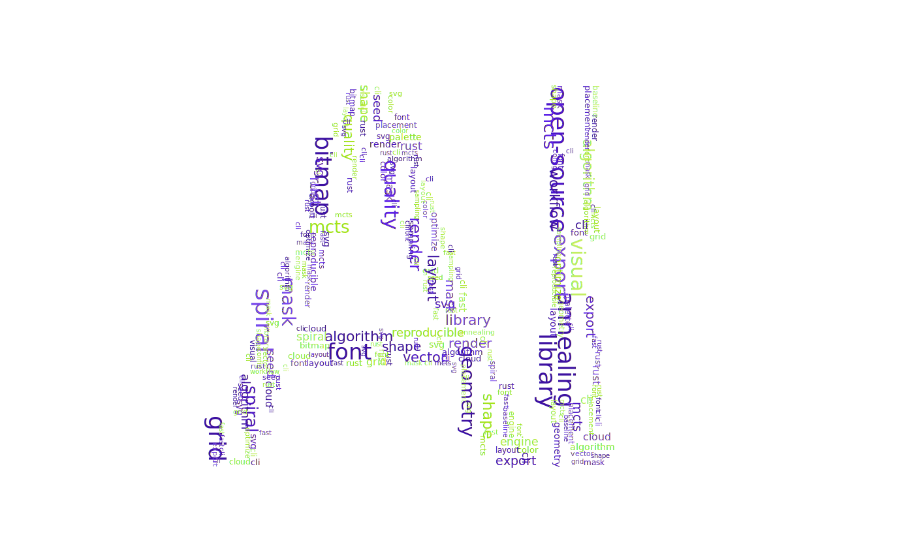
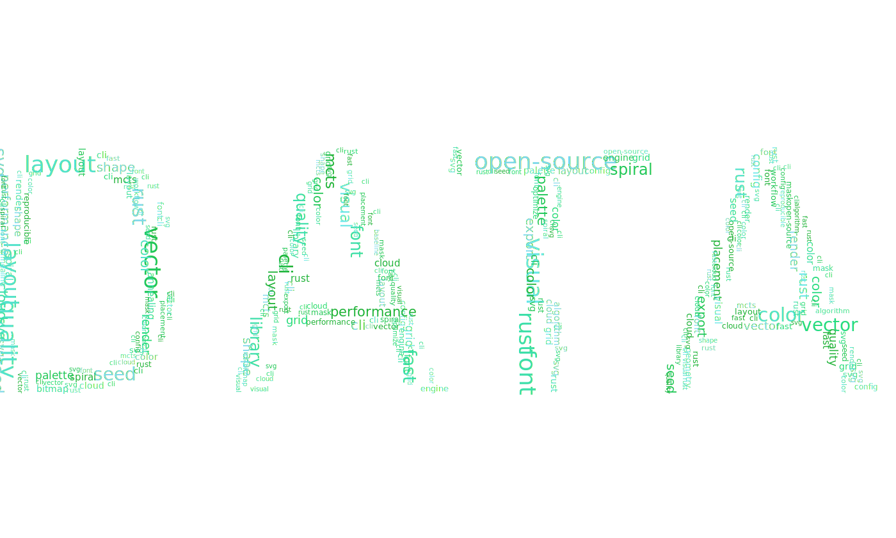
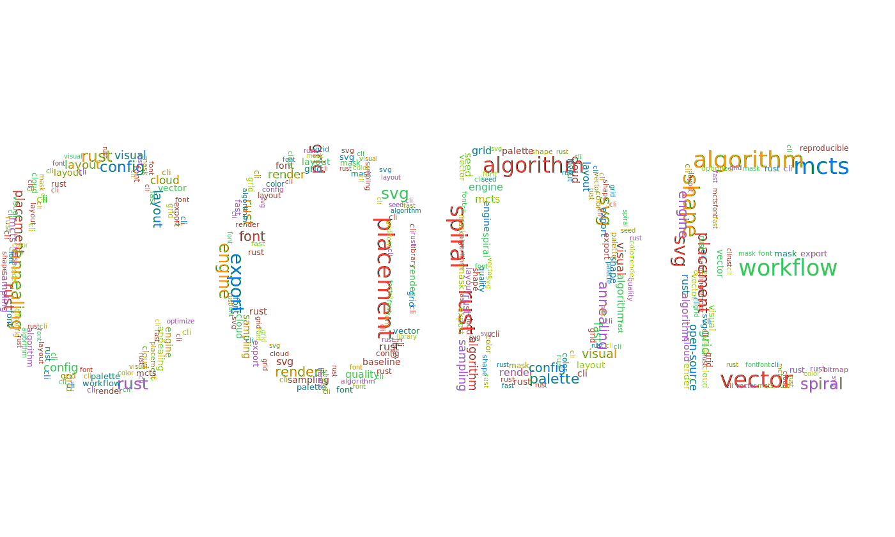

# Char Cloud

[](https://crates.io/crates/char-cloud)
[](https://github.com/Acture/char-cloud/actions/workflows/release.yml)
[](LICENSE)

Generate beautiful **shape-constrained SVG word clouds** in seconds.

Char Cloud is a **Rust CLI + reusable library** that packs multiple layout algorithms, reproducible output, palette tooling, and configurable font loading into one fast workflow.

## Why Char Cloud

- Fast by default: `fast-grid` is tuned for real workloads
- Better quality options: `mcts`, `simulated-annealing`, `spiral-greedy`
- Reproducible runs with `--seed`
- Weighted words, rotation sets, and automatic palettes
- Global + project config (`TOML`) for repeatable teams and CI
- CLI for speed, library API for integration

## Install

```bash
cargo install char-cloud
```

Optional: include embedded Noto Sans SC at build time.

```bash
cargo install char-cloud --features embedded_fonts
```

## Quick Start

```bash
char-cloud \
  --text "RUST" \
  --words "cloud,speed,layout,mask,svg,grid" \
  --canvas-size 1400,800 \
  --algorithm fast-grid \
  --palette auto \
  --seed 42 \
  --output output.svg
```

Use weighted input from file:

```text
# words.txt
rust,3
cloud,2
layout,2
mask
svg
```

```bash
char-cloud --text "AI" --word-file words.txt --algorithm spiral-greedy --rotations 0,90 --output ai.svg
```

Show all flags:

```bash
char-cloud --help
```

## Example Gallery

Generated with fixed seeds, `fast-grid`, and `fonts/Roboto-Regular.ttf`.

| RUST (`auto`) | AI (`complementary`) |
|---|---|
|  |  |

| DATA (`analogous`) | CODE (`vibrant`) |
|---|---|
|  |  |

Reproduce these assets:

```bash
bash docs/examples/generate.sh
```

## Algorithm Cheat Sheet

| Algorithm | Speed | Fill Quality | Best Use Case |
|---|---:|---:|---|
| `fast-grid` | High | High | Default production choice |
| `mcts` | Medium-Low | High | Search-driven quality improvements |
| `simulated-annealing` | Medium-Low | Medium-High | Stochastic optimization and exploration |
| `spiral-greedy` | Medium | Medium-High | Center-focused, stable visual structure |
| `random-baseline` | Low | Medium | Baseline and regression comparison |

## Library API (Minimal)

```rust
use char_cloud::{
	generate, load_font_from_file, AlgorithmKind, CanvasConfig, CloudRequest, FontSizeSpec,
	RenderOptions, ShapeConfig, StyleConfig, WordEntry,
};
use std::{path::Path, sync::Arc};

let font = load_font_from_file(Path::new("fonts/NotoSansSC-Regular.ttf"))?;
let result = generate(CloudRequest {
	canvas: CanvasConfig { width: 1200, height: 700, margin: 12 },
	shape: ShapeConfig { text: "DATA".into(), font_size: FontSizeSpec::AutoFit },
	words: vec![WordEntry::new("rust", 2.0), WordEntry::new("svg", 1.0)],
	style: StyleConfig::default(),
	algorithm: AlgorithmKind::FastGrid,
	ratio_threshold: 0.85,
	max_try_count: 10_000,
	seed: Some(7),
	font: Arc::new(font),
	render: RenderOptions::default(),
})?;
std::fs::write("cloud.svg", result.svg)?;
# Ok::<(), Box<dyn std::error::Error>>(())
```

## Fonts

- Default behavior: try system fonts automatically
- Use `--font <path>` to pin a `.ttf/.otf`
- Use `--choose-system-font` for interactive font selection
- Embedded font feature: `embedded_fonts` (off by default)
- Embedded font: Noto Sans SC, SIL Open Font License 1.1
- License text: `fonts/OFL-NotoSansSC.txt`

## Config

Config precedence (later overrides earlier):

1. `~/.config/char-cloud/config.toml` (or `$XDG_CONFIG_HOME/char-cloud/config.toml`)
2. `.char-cloud.toml` in current directory
3. `--config <path>`
4. CLI flags

Minimal example:

```toml
canvas_size = [1600, 900]
algorithm = "fast-grid"
palette = "analogous"
palette_base = "#0EA5E9"
ratio = 0.85
max_tries = 12000
rotations = [0, 90]
```

## Release Automation

`Release` workflow now supports end-to-end publishing to:

- GitHub Releases (tag-triggered or manual dispatch)
- crates.io (`cargo publish`)
- Homebrew tap: `Acture/homebrew-ac` (`Formula/char-cloud.rb`)

Required repository secrets:

- `CARGO_REGISTRY_TOKEN`: crates.io publish token
- `HOMEBREW_TAP_TOKEN`: PAT with push access to `Acture/homebrew-ac`

Trigger modes:

- Automatic: push a tag like `v0.2.1`
- Manual: run `Release` workflow with input `tag`, optionally enabling `publish_cargo` and `update_homebrew`

## Documentation

- [Architecture](docs/architecture.md)
- [Library API](docs/library-api.md)
- [Algorithms](docs/algorithms.md)
- [Tuning](docs/tuning.md)
- [Migration v0.2](docs/migration-v0.2.md)

## License

AGPL-3.0. See [LICENSE](LICENSE).
